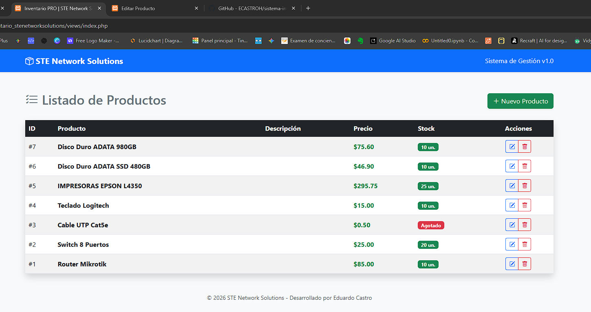
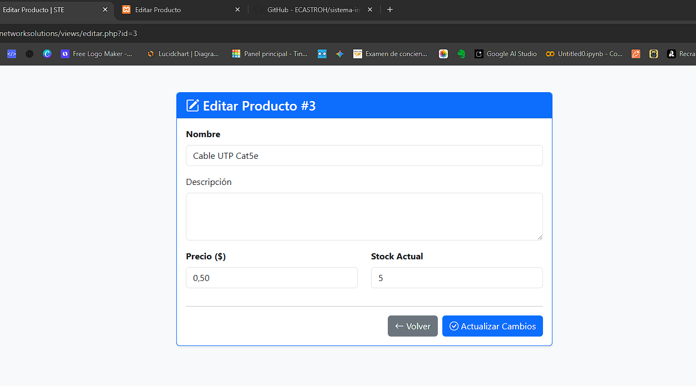
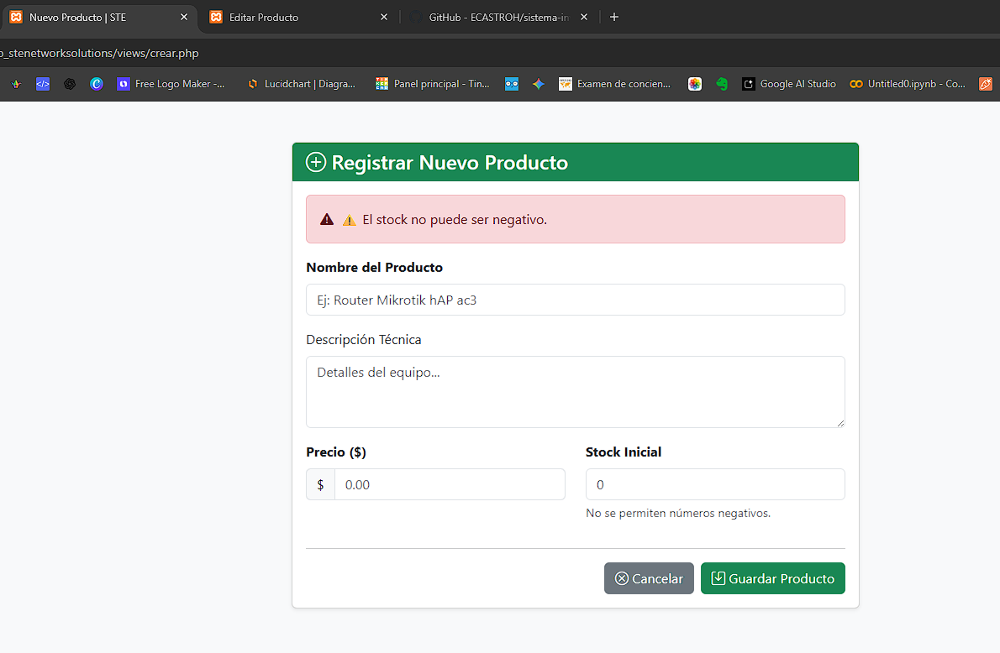
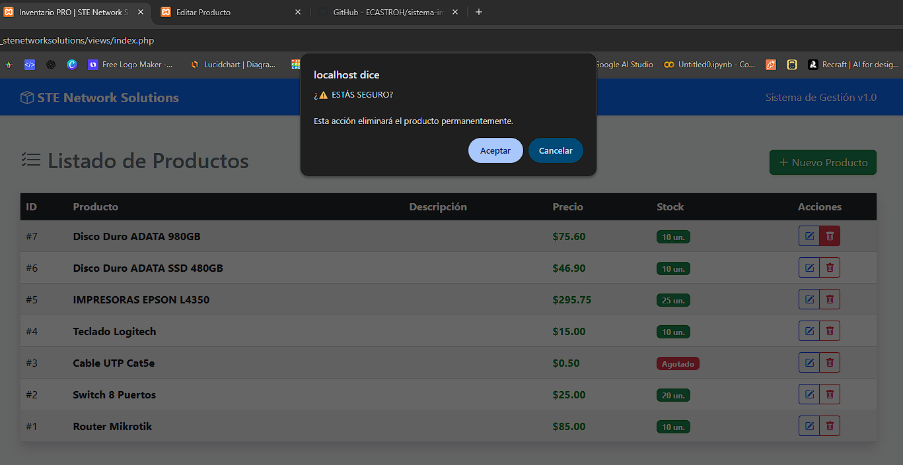

# Sistema de Inventario - STE Network Solutions

## Descripción del Proyecto
Sistema de gestión de inventario desarrollado en **PHP Nativo (PDO)** con una arquitectura profesional por capas.
Esta versión incluye desarrollo en seguridad, experiencia de usuario (UI/UX) y validaciones de negocio.

## Características
* **Seguridad:** Protección contra ataques **XSS (Cross-Site Scripting)** en todos los formularios.
* **Interfaz Moderna:** Diseño responsivo utilizando **Bootstrap 5** y **Bootstrap Icons**.
* **Feedback Visual:** Badges de colores automáticos para el estado del stock (Agotado/Bajo/Normal).
* **Validaciones Robustas:** Control de stock negativo y precios lógicos tanto en Backend como en Frontend.
* **Confirmaciones:** Alertas interactivas con JavaScript antes de eliminar registros.

## Tecnologías
* **Entorno de Desarrollo:** XAMPP (Apache + MySQL/MariaDB)
* **Lenguaje:** PHP 8 (Nativo)
* **Frontend:** Bootstrap 5 (CSS y JS)
* **Control de Versiones:** Git & GitHub

## Instalación en XAMPP
1. **Despliegue:**
   - Coloca la carpeta del proyecto en: `C:\xampp\htdocs\inventario_stenetworksolutions`

2. **Base de Datos:**
   - Crea la BD `inventario_ste` en phpMyAdmin.
   - Importa el script: `database/database.sql`.

3. **Configuración:**
   - El sistema conecta automáticamente con usuario `root` y sin contraseña (default de XAMPP) en `config/conexion.php`.

4. **Ejecución:**
   - Ingresa a: `http://localhost/inventario_stenetworksolutions/views/`

## Capturas del Sistema

### Panel Principal (Dashboard)

### Gestión de Productos

### Validaciones de Seguridad

### Gestión de productos

**Autor:** Eduardo Castro | Ingeniería en Sistemas Inteligentes | Ecotec On Line